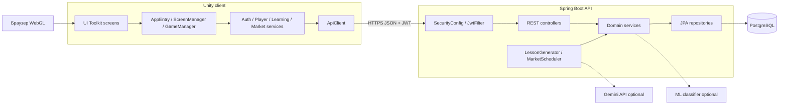
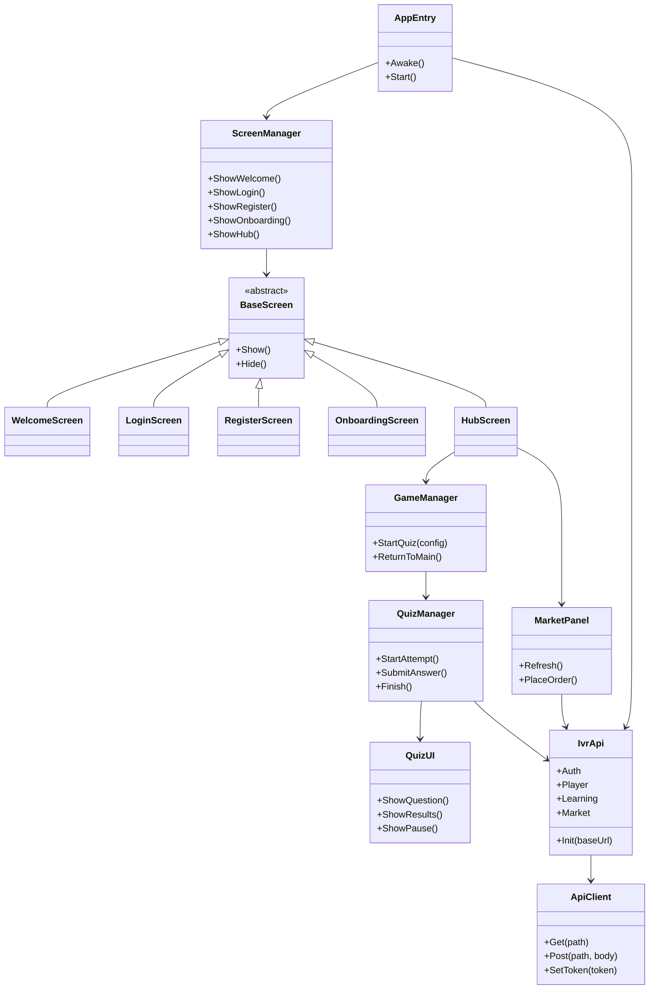
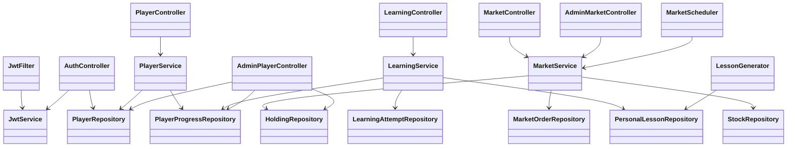

# Компоненты и ключевые классы

## Компоненты

```mermaid
flowchart LR
    Browser[Браузер WebGL]
    subgraph Unity[Unity client]
        Screens[UI Toolkit screens]
        Managers[AppEntry / ScreenManager / GameManager]
        Services[Auth / Player / Learning / Market services]
        Api[ApiClient]
    end
    subgraph Spring[Spring Boot API]
        Security[SecurityConfig / JwtFilter]
        Controllers[REST controllers]
        Domain[Domain services]
        Repositories[JPA repositories]
        Schedulers[LessonGenerator / MarketScheduler]
    end
    Db[(PostgreSQL)]
    Gemini[Gemini API optional]
    Ml[ML classifier optional]

    Browser --> Screens
    Screens --> Managers
    Managers --> Services
    Services --> Api
    Api -->|HTTPS JSON + JWT| Security
    Security --> Controllers
    Controllers --> Domain
    Domain --> Repositories
    Repositories --> Db
    Schedulers --> Domain
    Schedulers -.-> Gemini
    Domain -.-> Ml
```

## Unity

```mermaid
classDiagram
    class AppEntry {
        +Awake()
        +Start()
    }
    class ScreenManager {
        +ShowWelcome()
        +ShowLogin()
        +ShowRegister()
        +ShowOnboarding()
        +ShowHub()
    }
    class BaseScreen {
        <<abstract>>
        +Show()
        +Hide()
    }
    class WelcomeScreen
    class LoginScreen
    class RegisterScreen
    class OnboardingScreen
    class HubScreen
    class GameManager {
        +StartQuiz(config)
        +ReturnToMain()
    }
    class QuizManager {
        +StartAttempt()
        +SubmitAnswer()
        +Finish()
    }
    class QuizUI {
        +ShowQuestion()
        +ShowResults()
        +ShowPause()
    }
    class MarketPanel {
        +Refresh()
        +PlaceOrder()
    }
    class IvrApi {
        +Init(baseUrl)
        +Auth
        +Player
        +Learning
        +Market
    }
    class ApiClient {
        +Get(path)
        +Post(path, body)
        +SetToken(token)
    }

    AppEntry --> ScreenManager
    AppEntry --> IvrApi
    ScreenManager --> BaseScreen
    BaseScreen <|-- WelcomeScreen
    BaseScreen <|-- LoginScreen
    BaseScreen <|-- RegisterScreen
    BaseScreen <|-- OnboardingScreen
    BaseScreen <|-- HubScreen
    HubScreen --> GameManager
    HubScreen --> MarketPanel
    GameManager --> QuizManager
    QuizManager --> QuizUI
    QuizManager --> IvrApi
    MarketPanel --> IvrApi
    IvrApi --> ApiClient
```

## Spring Boot

```mermaid
classDiagram
    class AuthController
    class PlayerController
    class LearningController
    class MarketController
    class AdminPlayerController
    class AdminMarketController
    class JwtFilter
    class JwtService
    class PlayerService
    class LearningService
    class MarketService
    class LessonGenerator
    class MarketScheduler
    class PlayerRepository
    class PlayerProgressRepository
    class LearningAttemptRepository
    class PersonalLessonRepository
    class StockRepository
    class HoldingRepository
    class MarketOrderRepository

    JwtFilter --> JwtService
    AuthController --> JwtService
    AuthController --> PlayerRepository
    PlayerController --> PlayerService
    PlayerService --> PlayerRepository
    PlayerService --> PlayerProgressRepository
    LearningController --> LearningService
    LearningService --> LearningAttemptRepository
    LearningService --> PersonalLessonRepository
    LearningService --> PlayerProgressRepository
    LessonGenerator --> PersonalLessonRepository
    MarketController --> MarketService
    AdminMarketController --> MarketService
    MarketScheduler --> MarketService
    MarketService --> StockRepository
    MarketService --> HoldingRepository
    MarketService --> MarketOrderRepository
    AdminPlayerController --> PlayerRepository
    AdminPlayerController --> PlayerProgressRepository
    AdminPlayerController --> HoldingRepository
```
